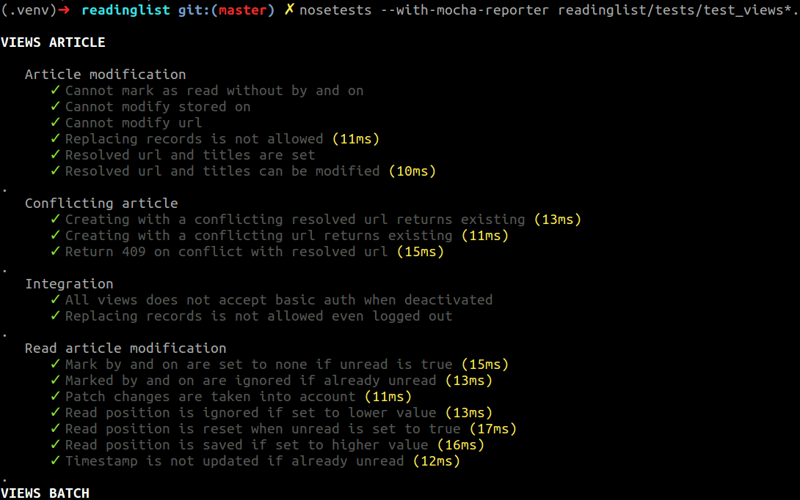

###################
nose-mocha-reporter
###################

Mimic default Mocha test reporter

INSTALL
=======

::

    python setup.py install

USAGE
=====

::

    nosetests --with-mocha-reporter

KNOWN PROBLEMS
==============

* Default Nose output is not fully removed (e.g. verbose mode)

LICENSE
=======

* WTFPL
